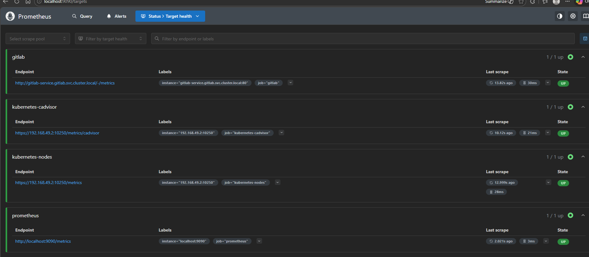
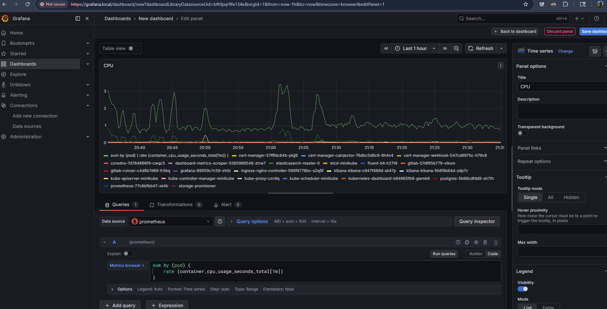
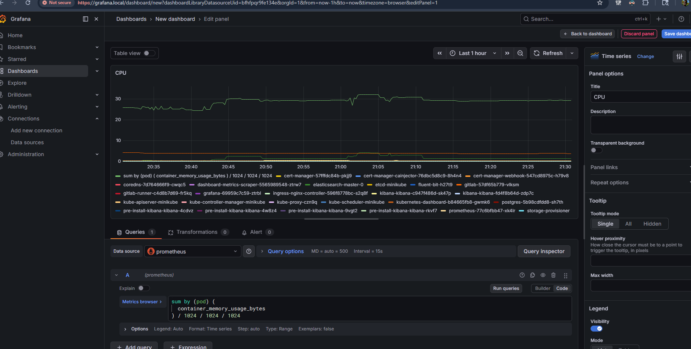
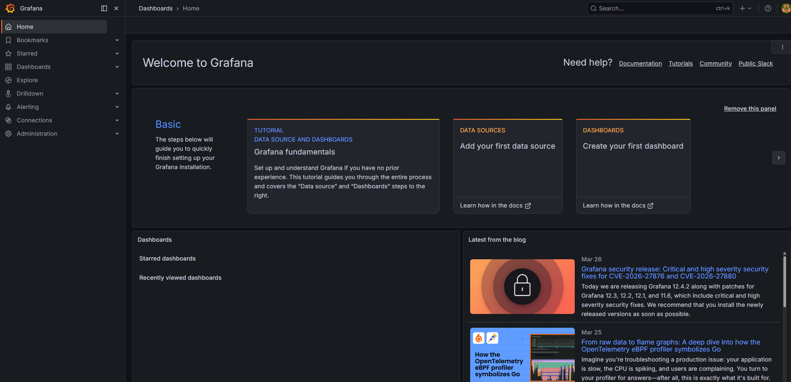

# Implementing Data Scraping and Visualization

This document details the configuration and architecture implemented to achieve comprehensive data scraping (Prometheus) and visualization (Grafana) for our Minikube Kubernetes cluster. This monitoring layer tracks container health, node CPU/Memory usage, and application-specific endpoints (like GitLab).

## 1. Architecture Overview
Our monitoring stack relies on a two-tier pull architecture:
- **Prometheus (Scraper):** Periodically polls metrics endpoints from various Kubernetes services and nodes.
- **Grafana (Visualization):** Connects to the Prometheus time-series database to render interactive dashboards.

Both services are isolated within the `gitlab` namespace alongside our primary application.

## 2. Configuring Prometheus Scraping
Initially, Prometheus failed to harvest hardware metrics from the cluster due to `HTTP 401 Unauthorized` errors. Minikube secures its Kubelet metrics API (`10250`), preventing unauthorized tools from scraping raw node configurations.

### Adding Kubelet Bearer Tokens
We updated the `prometheus-config.yaml` to explicitly pass the default Kubernetes ServiceAccount token when polling the core Kubernetes components (`kubernetes-nodes` and `kubernetes-cadvisor`). By using the `insecure_skip_verify: true` and `bearer_token_file` directives, Prometheus securely identified itself to the Kubelet API, successfully resolving the 401 connection blocks.

### Example Scrape Configuration
```yaml
- job_name: 'kubernetes-cadvisor'
  static_configs:
    - targets: ['192.168.49.2:10250'] # Minikube Node IP
  metrics_path: /metrics/cadvisor
  scheme: https
  bearer_token_file: /var/run/secrets/kubernetes.io/serviceaccount/token
  tls_config:
    insecure_skip_verify: true
```



## 3. RBAC (Role-Based Access Control) Policy Upgrades
Even after securing a valid token, Prometheus was denied access to specific hardware subsystems (cAdvisor) due to missing permissions. We edited the Kubernetes `ClusterRole` in `rbac.yaml` to explicitly grant access to:
- `nodes/stats` (To read hardware telemetry)
- `nodes/proxy` (To read underlying network proxies)

By authorizing these subresources, Prometheus was finally able to harvest low-level CPU and Memory usage data per-container.

## 4. Visualizing Data in Grafana
Once Prometheus was fully healthy and indexing data, we deployed Grafana and connected Prometheus as its primary internal Data Source. 

Using **PromQL** (Prometheus Query Language), we created customized dashboards to track key system performance vectors that allowed us to identify bottlenecks in our Elasticsearch scaling later in the project.

### CPU Tracking
By tracking `container_cpu_usage_seconds_total`, we dynamically scaled the visibility of CPU strains across time intervals.


### Memory Tracking
Similar queries were utilized to map out Java Heap memory thresholds, actively aiding our debugging loops and preventing `OOMKilled` crashes on our databases.



