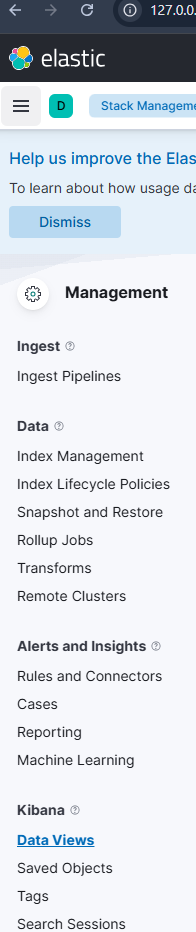
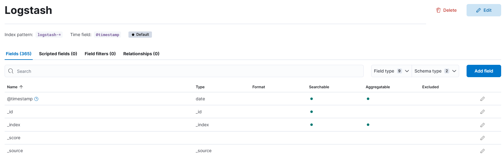
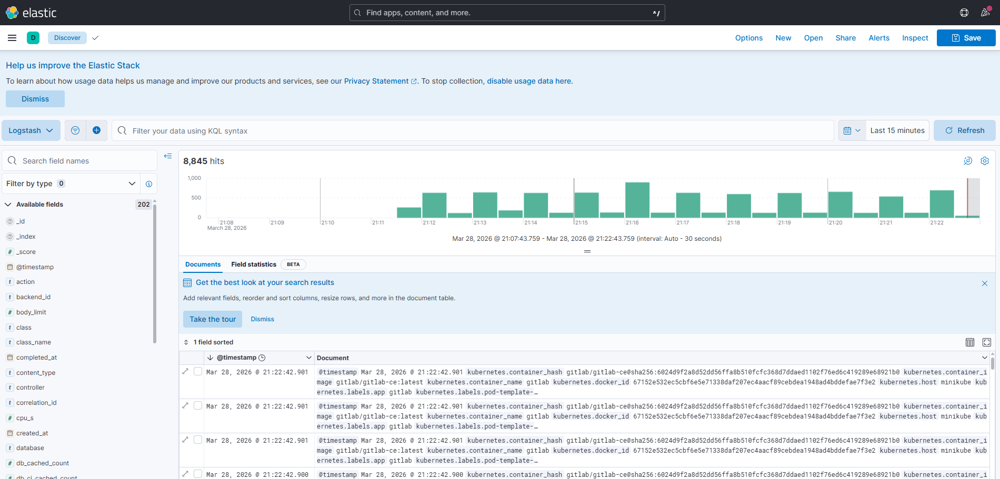

# Implementing Logging (The EFK Stack)

This document encompasses the entire architectural blueprint and troubleshooting process for deploying a comprehensive EFK (Elasticsearch, Fluent Bit, Kibana) logging stack inside a constrained local Minikube environment.

## 1. Architectural Pivot: Discarding Logstash
Traditional logging implementations rely heavily on the ELK stack (Elasticsearch, Logstash, Kibana). However, Logstash is a monolithic Java application with extreme memory overhead. Running this alongside GitLab on a single Minikube virtual machine would cause catastrophic CPU throttling and repetitive `OOMKilled` crashes.

Therefore, we definitively pivoted to **EFK**.
We replaced Logstash with **Fluent Bit**, an incredibly fast, lightweight log scraper written in C (specifically configured as a Kubernetes `DaemonSet`). Fluent Bit natively scrapes `/var/log/containers/*.log`, binds Kubernetes telemetry tags (like pod names and namespaces) to each log, and routes them securely to Elasticsearch using only a fraction of the memory (15MB vs 1GB+).

### Impersonating Logstash
Because the rest of the Elasticsearch platform heavily anticipates Logstash-formatted telemetry, we explicitly configured Fluent Bit using `Logstash_Format On`.
This parameter dynamically disguises the outgoing JSON payload so Elasticsearch safely indices it as `logstash-<date_string>`, ensuring 100% native compatibility with Kibana's frontend parsing!

## 2. Optimizing the Elasticsearch Backend
Deploying the official Elasticsearch 8.x Helm Chart required extensive customization to survive inside a local Minikube cluster:

### Securing RAM Against `OOMKilled` Errors
Initially, constrained memory limits caused the Elasticsearch JVM (Java Virtual Machine) to abort boot procedures.
We expanded the core resources by modifying `es-values.yaml`:
- **Heap Definition:** `esJavaOpts: "-Xmx1g -Xms1g"`
- **Hard Resource Limits:** Minimum Requests set to 2GB to prevent the orchestrator from prematurely suffocating the pod.

### Surviving the Single-Node Readiness Trap
Because Elasticsearch was strictly scaled to a single replica (`replicas: 1`), it lacked backup nodes to distribute its inner indices. This caused the cluster's internal health status to register as `Yellow`, prompting the `wait_for_status=green` health check to infinitely reject network connections.

We modified `clusterHealthCheckParams` to dynamically accept a `Yellow` internal state, instantly passing the readiness probe and restoring Minikube networking connectivity to the `elasticsearch-master` DNS.

## 3. Disarming Security Mismatches
Elastic version 8.x strictly enforces TLS/HTTPS verification out of the box. Running internal certificate authorities locally is notoriously problematic, so we intentionally deactivated `xpack.security` across the board:
- Handled via `xpack.security.enabled: false` & `protocol: http`.
- Exposing port 9200 as plain-text HTTP for pure internal DNS traffic.

### Bypassing Kibana's Pre-Install Loop
Despite instructing Kibana to turn off security checks, the Elastic v8 Helm chart generated a `pre-install` daemon that aggressively demanded a physical Kubernetes Secret (`kibana-kibana-es-token`), trapping Kibana in a repetitive `CreateContainerConfigError` loop.
We solved this by **manually injecting a Kubernetes Secret** object containing a dummy password directly into the cluster dataset (`etcd`), allowing the Kibana engine to successfully satisfy its mounting requirements and fully boot into its `Running` phase!

## 4. Visualizing Data in Kibana
After successfully chaining the tools via internal DNS routing, we exposed the UI mapping directly to the host machine workspace via `kubectl port-forward`. 

By entering Kibana's **Stack Management**, we created a global **Data View** targeting the exact index pattern Fluent Bit was scraping: `logstash-*`

Now, Kibana successfully scrapes, parses, and identifies thousands of logs live from the entire Minikube architecture inside the **Discover** tab!

### The Final Visual Experience

