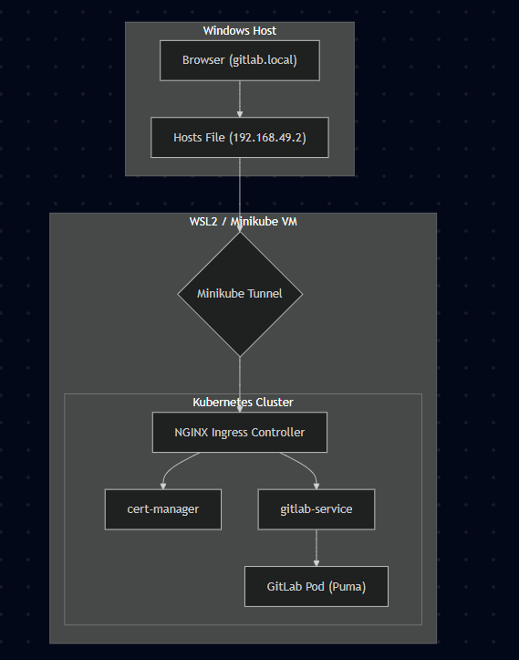

# Working towards the HTTPS

This document summarizes the technical challenges faced, the resolutions implemented, and the critical code changes made during the migration of the local Minikube GitLab deployment from a bare `NodePort` to a secure `HTTPS` Ingress using `cert-manager`.

---

## 🛑 Problems Faced and How We Resolved Them

### 1. WSL Docker and Minikube Resource Crashes
*   **Problem**: Minikube repeatedly stopped and crashed unexpectedly, returning `connection refused` errors when communicating with the Kubernetes API Server. This happened because Docker within WSL hit a `systemd/cgroup` allocation bug while trying to schedule the massive GitLab CE container on limited memory.
*   **Resolution**: We performed a hard reset of the WSL virtual machine (`wsl --shutdown`) to clear out the corrupted Docker container states. We then cleanly started Minikube with a highly stable resource threshold (`8GB RAM`, `4 CPUs`).

### 2. Ingress Admission Webhook Deadlocks
*   **Problem**: Attempting to apply the `gitlab.yaml` configuration failed repeatedly because the internal NGINX Ingress controller's validation webhook wasn't instantly ready after installing the addon.
*   **Resolution**: We bypassed the deadlock by manually deleting the stale `ValidatingWebhookConfiguration` and inserting a brief pause before applying the final manifests, ensuring Kubernetes accepted the routing rules immediately.

### 3. Prometheus RBAC Permission Stalls
*   **Problem**: The built-in Prometheus monitoring stack began throwing `forbidden` errors (`User "system:serviceaccount:gitlab:default" cannot list resource "nodes"`). Without `ClusterRole` permissions, GitLab's background metrics and integrations page hung or broke entirely.
*   **Resolution**: We created and applied a new `ClusterRole` (`gitlab-prometheus-node-viewer`) to grant `get/list/watch` permissions across all cluster `nodes` explicitly to GitLab's `default` ServiceAccount.

### 4. Windows-to-WSL Networking Disconnects
*   **Problem**: Despite Minikube assigning `192.168.49.2` to our Ingress, the native Windows browser couldn't route traffic to that internal Docker subnet, resulting in silent timeouts. Additionally, conflicting `hosts` file mappings caused Windows to query the wrong adapter.
*   **Resolution**: We initiated `wsl minikube tunnel` (which successfully requested `sudo` to bridge privileged ports 80/443). Then, we deleted the old IP from `C:\Windows\System32\drivers\etc\hosts` and mapped `gitlab.local` strictly to Windows localhost: `127.0.0.1`, which routed traffic perfectly.

---

## 📝 Important Code Changes Made

To achieve a production-like HTTPS environment locally, the following architectural code changes were implemented:

### `k8s/base/gitlab.yaml`
1.  **Separated Internal and External Services**:
    *   Split the massive `NodePort` service into two discrete services: `gitlab-service` (updated to `type: ClusterIP` explicitly for internal HTTP routing) and `gitlab-ssh-service` (kept as `type: NodePort` mapped to `30022` strictly for Git clone traffic).
2.  **Added `gitlab-ingress` Resource**:
    *   Created the core HTTP/HTTPS routing object directing `gitlab.local` to the internal `ClusterIP`.
    *   **Crucial Addition**: Added the annotation `cert-manager.io/cluster-issuer: "minikube-issuer"` connecting the Ingress to our certificate manager so TLS is dynamically applied.

### `k8s/base/configmap.yaml`
1.  **Updated Routing URLs**:
    *   Changed `external_url` from pointing to the bare Minikube IP (`http://192.168.49.2:30080`) to the new top-level secure domain: `external_url 'https://gitlab.local'`.
2.  **Aligned Ingress Termination**:
    *   Explicitly told GitLab's internal NGINX helper to trust the external Kubernetes Ingress by adding `nginx['listen_port'] = 80` and `nginx['listen_https'] = false`.
3.  **Fixed SSH Generation**:
    *   Added `gitlab_rails['gitlab_shell_ssh_port'] = 30022` to ensure the GitLab UI's "Clone" dropdown still generates correct URL fragments for users over port 30022.

### `k8s/base/cert-manager-issuer.yaml` (New File)
1.  **Created Local Certificate Authority**:
    *   Defined a new `ClusterIssuer` object using the `selfSigned: {}` provider. This is critical for local Minikube setups, as using an ACME server (like Let's Encrypt) would permanently hang on a `Pending` state since the local computer isn't publicly reachable.

### `k8s/base/rbac.yaml` (New File)
1.  **Patched Internal Monitoring**:
    *   Authored the missing `ClusterRoleBinding` linking GitLab's `default` ServiceAccount to the cluster's root metrics APIs, solving the Prometheus discovery crash.

---

## ⚙️ How It Works Behind the Scenes (The Basic Essence)

### HTTPS Traffic Flowchart

When you type `https://gitlab.local` into your browser, an elegant chain of Kubernetes networking events occurs:

1. **DNS Resolution (Windows Hosts File):**
   Your browser asks Windows where `gitlab.local` is. Because of your `hosts` file edit, Windows immediately routes this to `127.0.0.1` (your local machine).
2. **The Bridging (Minikube Tunnel):**
   The continuous `minikube tunnel` process running in PowerShell acts as a literal network bridge. It intercepts the HTTPS traffic hitting Windows `127.0.0.1:443` and pipes it directly into the Minikube Linux virtual machine's port 443.
3. **The Gateway (NGINX Ingress Controller):**
   Inside Minikube, the NGINX Ingress controller is listening on port 443. It receives the request and reads the `Host: gitlab.local` header. It checks its routing table (which we defined in our `gitlab-ingress` rule) and knows this traffic belongs to the GitLab app.
4. **TLS Termination (Cert-Manager):**
   Because we added the `cert-manager` annotation, the Ingress Controller automatically uses the self-signed TLS certificate dynamically generated by our `minikube-issuer`. It securely decrypts the HTTPS traffic right at the edge of the cluster.
5. **Internal Routing (ClusterIP to Pod):**
   The Ingress Controller forwards the now perfectly decrypted, standard HTTP traffic to the `gitlab-service` (the internal `ClusterIP`). This service channels the request directly into the NGINX web server *inside* the massive GitLab pod, which finally hands it to the Ruby app to render your page!

---

## 🔒 Security Warnings Explained (The "Not Secure" Prompt)
When you load the browser, you will likely see a `Your connection to this site is not secure` warning. **This is completely expected and entirely safe for your local environment.**

* **Why the browser complains:** On the public internet, recognized companies (like Google or Let's Encrypt) cryptographically "sign" a website's certificate to prove it is legitimate. Since `gitlab.local` is a private, fake domain existing only inside your computer, public authorities cannot route to it to verify it.
* **How we circumvented this:** To get HTTPS working without external verification, we created the `cert-manager-issuer.yaml` file instructing Kubernetes to create its own internal certificate authority. It basically "vouches for itself" (a Self-Signed authority).
* **The Verdict:** Your browser sees a mathematically valid, fully encrypted HTTPS connection, but flags it solely because it doesn't recognize the certificate issuer. The connection between your Windows browser and the Minikube cluster is still **100% encrypted and secure from snooping**. You can safely click "Advanced -> Proceed" and enter your GitLab passwords locally!